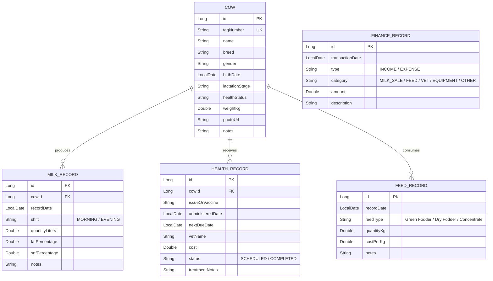

# 🐄 Smart Dairy Management System - System Architecture & Design

> **Healthy Cows | Better Milk | Smarter Farming**  
> An AI-powered fullstack platform designed for modern dairy farmers, built for web and mobile readiness.

---

## 1. High-Level System Architecture

```
┌────────────────────────────────────────────────────────────────────────┐
│                          PRESENTATION LAYER                            │
│                                                                        │
│   ┌────────────────────────┐             ┌─────────────────────────┐   │
│   │   React.js Web App     │             │  Mobile App (Android)   │   │
│   │ (Vite, Tailwind, PWA)  │             │ (React Native / Flutter)│   │
│   └───────────┬────────────┘             └────────────┬────────────┘   │
└───────────────┼───────────────────────────────────────┼────────────────┘
                │            REST APIs (JSON)           │
                ▼                                       ▼
┌────────────────────────────────────────────────────────────────────────┐
│                        APPLICATION LAYER (BACKEND)                     │
│                                                                        │
│                   Spring Boot 3.x (Java REST API)                     │
│   ┌────────────────────────────────────────────────────────────────┐   │
│   │   REST Controllers:                                            │   │
│   │   • /api/cows              • /api/milk-records                 │   │
│   │   • /api/health-records    • /api/feed-records                 │   │
│   │   • /api/finances          • /api/dashboard/stats              │   │
│   │   • /api/ai/advise                                             │   │
│   └────────────────────────────────┬───────────────────────────────┘   │
│                                    │                                   │
│   ┌────────────────────────────────▼───────────────────────────────┐   │
│   │   Business Services & Spring Data JPA Hibernate                │   │
│   │   • Aggregations, Yield Analytics, Profit/Loss, Alerts Engine  │   │
│   └────────────────────────────────┬───────────────────────────────┘   │
└────────────────────────────────────┼───────────────────────────────────┘
                                     │ Encrypted SSL (PostgreSQL Wire)
                                     ▼
┌────────────────────────────────────────────────────────────────────────┐
│                          DATA PERSISTENCE                              │
│                                                                        │
│   ┌────────────────────────────────────────────────────────────────┐   │
│   │         Supabase Cloud (PostgreSQL with SSL Encryption)        │   │
│   │   • Tables: cows, milk_records, health_records, finances       │   │
│   │   • Cloud Storage: Cattle photos, Medical invoices             │   │
│   │   • Built-in Backups & 24/7 Cloud Availability                 │   │
│   └────────────────────────────────────────────────────────────────┘   │
└────────────────────────────────────────────────────────────────────────┘
```

---

## 2. Database ER Diagram (Entity-Relationship)



---

## 3. Security & Safety Model

1. **Decoupled Architecture**: Frontend and Mobile clients NEVER access the database directly. All database credentials remain inside the Spring Boot backend.
2. **Encrypted in Transit**: Supabase connects via `sslmode=require` (TLS 1.3).
3. **CORS Protected**: Configured in Spring Boot to restrict origin domain requests.
4. **Input Sanitization & Prepared Statements**: Hibernate/JPA uses parameterized queries by default, protecting completely against SQL injection.
5. **Mobile-Ready**: Stateless JSON endpoints ready for JWT / OAuth2 token authentication.

---

## 4. API Endpoints Specification

| Method | Endpoint | Description |
| :--- | :--- | :--- |
| `GET` | `/api/dashboard/stats` | Aggregate dashboard metrics (Cow count, Today's milk yield, Alerts, Month's finance) |
| `GET` | `/api/cows` | Retrieve all cows |
| `POST` | `/api/cows` | Register a new cow |
| `GET` | `/api/cows/{id}` | Get specific cow details and history |
| `PUT` | `/api/cows/{id}` | Update cow details |
| `DELETE` | `/api/cows/{id}` | Remove cow record |
| `GET` | `/api/milk-records` | List milk logs (supports date filtering) |
| `POST` | `/api/milk-records` | Record morning/evening milk output |
| `GET` | `/api/health-records` | View all vaccination & health treatments |
| `GET` | `/api/health-records/alerts` | Get upcoming vaccination reminders |
| `POST` | `/api/health-records` | Schedule or record a medical treatment |
| `GET` | `/api/finances` | Get all financial transactions |
| `POST` | `/api/finances` | Add an income or expense transaction |
| `POST` | `/api/ai/advise` | Get smart suggestions for nutrition, milk yield, or health |
